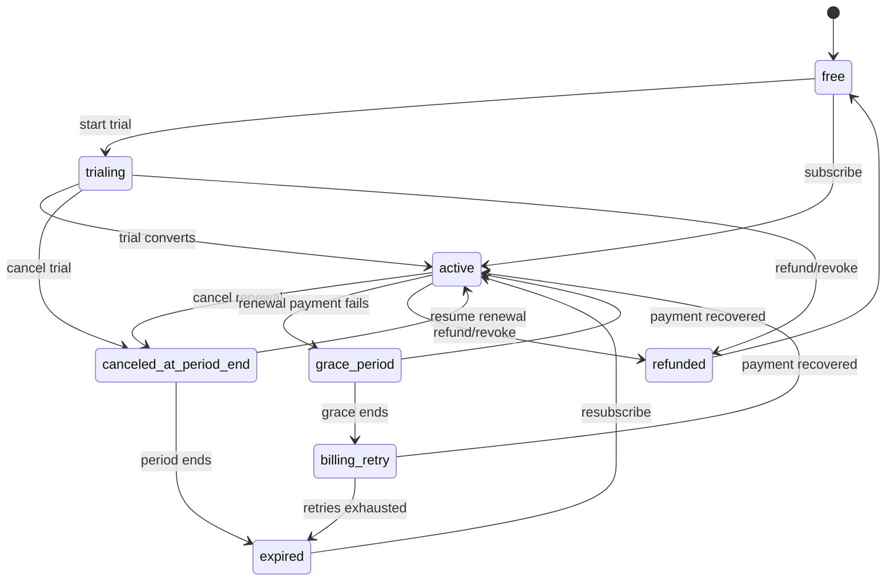

# 国外 App 订阅付费完整流程

本文档整理海外 App 订阅付费的标准产品流程，默认以 iOS App Store 和 Google Play 内购订阅为主，补充 Web/Stripe 订阅的差异。目标读者包括产品、设计、研发、测试和运营同学。

适用于 MOVEVI Premium 这类持续型会员权益：用户按月或按年付费，获得高级路线、功能或内容访问权，并可在当前账期结束前取消自动续订。

## 1. 基本原则

### 1.1 渠道优先级

| 渠道 | 典型入口 | 付款确认 | 取消/管理位置 | 适用场景 |
| --- | --- | --- | --- | --- |
| iOS App Store | App 内 Paywall | Apple 系统购买弹窗 | Apple 订阅管理页 | iPhone/iPad App 内数字内容订阅 |
| Google Play | App 内 Paywall | Google Play 购买弹窗 | Google Play 订阅管理页 | Android App 内数字内容订阅 |
| Web/Stripe | 官网、Web App、邮件落地页 | Stripe Checkout 或内嵌支付 | Stripe Customer Portal 或自建账单页 | 官网订阅、跨平台账号、B2B 或非商店渠道 |

海外主流 App 通常遵循一个原则：用户在哪个渠道订阅，就回到哪个渠道管理和取消。App 内可以展示状态、权益和帮助说明，但不能伪装成已经在 App 内直接取消了商店订阅。

### 1.2 合规信息

Paywall 和确认前页面必须清楚展示：

- 订阅套餐名称，例如 `MOVEVI Premium Monthly`。
- 价格、币种、计费周期，例如 `$4.99/month`。
- 免费试用或优惠期结束后的正式价格。
- 自动续订说明。
- 取消方式和取消截止时间。
- 核心权益，不夸大或误导。
- Terms of Service 和 Privacy Policy 入口。
- Restore Purchases 入口，尤其是 iOS。

## 2. 订阅状态模型

建议后端和客户端统一使用以下状态。客户端可以展示更友好的文案，但业务判断应使用统一状态。

| 状态 | 含义 | 是否有 Premium 权益 | 典型展示 |
| --- | --- | --- | --- |
| `free` | 从未订阅或无有效订阅 | 否 | Free plan |
| `trialing` | 免费试用中 | 是 | Trial ends on Jan 20 |
| `active` | 已付费且自动续订中 | 是 | Renews on Jan 20 |
| `canceled_at_period_end` | 已取消续订，但账期未结束 | 是 | Ends on Jan 20 |
| `grace_period` | 续费失败后的宽限期 | 是 | Payment issue. Update payment method |
| `billing_retry` | 支付重试或账户保留期 | 可按策略限制 | Premium paused until payment is fixed |
| `expired` | 订阅已到期 | 否 | Premium expired |
| `refunded` | 已退款或被撤销 | 否 | Subscription refunded |

### 2.1 状态流转

## 3. 首次订阅流程

### 3.1 触发入口

常见入口：

- Premium 路线或功能被锁定时点击 Unlock。
- Profile 或 Account 页的订阅卡片。
- Onboarding 后的会员权益页。
- 活动奖励页或限时优惠页。
- Web 官网或邮件中的升级入口。

入口点击后进入 Paywall，不直接触发系统支付弹窗。这样用户先看到权益、价格和取消说明。

### 3.2 Paywall 页面

Paywall 建议包含：

- 标题：`MOVEVI Premium`。
- 核心权益：解锁全部城市路线、活动路线、未来路线更新等。
- 套餐卡片：月付、年付、试用或优惠。
- 价格和周期：`$4.99/month`。
- 自动续订说明：`Renews automatically. Cancel anytime before the next billing date.`。
- CTA：`Subscribe`、`Start free trial`。
- 次要入口：`Restore Purchases`、`Terms`、`Privacy`。

### 3.3 商店支付

iOS：

1. 客户端请求 App Store Product 信息。
2. 用户点击订阅 CTA。
3. 弹出 Apple 系统购买确认。
4. 用户使用 Apple ID、Face ID、Touch ID 或密码确认。
5. 客户端收到交易结果。
6. 客户端把 transaction id / receipt / signed transaction 上传后端校验。
7. 后端记录订阅状态并下发权益。

Android：

1. 客户端请求 Google Play Product Details。
2. 用户点击订阅 CTA。
3. 弹出 Google Play 购买确认。
4. 用户确认付款。
5. 客户端收到 purchase token。
6. 客户端把 purchase token 上传后端校验。
7. 后端确认 purchase acknowledged，并记录订阅状态。
8. 客户端刷新权益。

Web/Stripe：

1. 用户点击 Web 订阅 CTA。
2. 前端请求创建 Stripe Checkout Session。
3. 用户跳转 Stripe Checkout 或打开内嵌支付页。
4. 支付成功后 Stripe webhook 通知后端。
5. 后端记录 subscription id、customer id 和状态。
6. 用户返回成功页，客户端刷新权益。

### 3.4 订阅成功

成功页或成功 Toast 应展示：

- Premium 已开通。
- 当前套餐和价格。
- 下次续订日期或试用结束日期。
- 关键权益已经解锁。
- 管理订阅入口的位置。

后台应完成：

- 写入用户订阅记录。
- 写入渠道、产品 ID、原始交易 ID、订单 ID 或 purchase token。
- 刷新权益缓存。
- 记录转化事件，例如 `subscription_started`。
- 发送订阅确认邮件或系统通知，如果产品需要。

## 4. 免费试用与优惠流程

### 4.1 展示规则

免费试用和优惠必须在用户确认前说明：

- 试用天数或优惠时长。
- 试用结束后价格。
- 自动续订规则。
- 何时取消可以避免扣费。

示例文案：

`7 days free, then $4.99/month. Cancel at least 24 hours before the trial ends to avoid being charged.`

### 4.2 状态流转

- 用户开始试用：`free` -> `trialing`。
- 试用期未取消且付款成功：`trialing` -> `active`。
- 试用期取消：`trialing` -> `canceled_at_period_end`，试用结束后 -> `expired`。
- 试用期支付失败：按商店或 Stripe 规则进入 `grace_period` 或 `expired`。

### 4.3 设计注意

- 不要隐藏取消入口。
- 不要用视觉手段弱化正式价格。
- 不要把“免费”作为唯一主信息，必须同时呈现续订价格。

## 5. 订阅管理流程

### 5.1 个人中心订阅卡片

已订阅用户应看到：

- 当前套餐：`Premium Monthly`。
- 当前状态：active、trialing、canceled 等。
- 下次续订或结束日期。
- 支付渠道：Apple、Google Play、Stripe。
- 管理按钮：`Manage Subscription`。

未订阅用户应看到：

- 主要权益。
- 价格。
- 升级按钮。

取消待生效用户应看到：

- `Premium stays available until {date}`。
- `You will not be charged again unless you resume.`。
- 恢复续订入口。

### 5.2 管理入口跳转

| 当前订阅渠道 | Manage Subscription 行为 |
| --- | --- |
| iOS App Store | 跳转 Apple 订阅管理页 |
| Google Play | 跳转 Google Play 订阅管理页 |
| Web/Stripe | 打开 Stripe Customer Portal 或自建账单页 |
| 未知渠道 | 展示帮助页和客服入口 |

产品文案需要明确：如果用户通过 Apple 或 Google Play 订阅，必须在对应商店取消。App 内的“管理”按钮只是帮助用户打开正确位置。

## 6. 取消订阅流程

### 6.1 标准路径

iOS/Android：

1. 用户点击 App 内 `Manage Subscription`。
2. App 跳转到 Apple 或 Google Play 订阅管理页。
3. 用户在系统页面选择取消。
4. 商店发送服务器通知。
5. 后端把状态更新为 `canceled_at_period_end`。
6. 客户端刷新后显示“权益保留到某日期”。
7. 当前周期结束后状态转为 `expired`，关闭 Premium 权益。

Web/Stripe：

1. 用户进入 Customer Portal。
2. 选择取消订阅。
3. Stripe webhook 通知后端。
4. 后端按策略设置 `cancel_at_period_end=true`。
5. 客户端显示结束日期。
6. 到期后状态转为 `expired`。

### 6.2 取消确认页口径

如果是 App 内自建取消说明页，不应假装替用户完成商店取消。推荐文案：

`Your subscription is managed by Apple. To stop renewal, open Apple Subscriptions and cancel MOVEVI Premium there. You will keep Premium access until the end of the current billing period.`

Web/Stripe 可在自建页或 Customer Portal 中完成取消，但仍需展示：

- 取消后不会再次扣费。
- 当前账期结束前仍有权益。
- 是否有退款，若无则说明不按比例退款。

## 7. 恢复购买与重新订阅

### 7.1 Restore Purchases

Restore Purchases 用于：

- 用户换设备。
- 用户重装 App。
- 用户登出后重新登录。
- 客户端状态丢失但商店仍有有效订阅。

流程：

1. 用户点击 `Restore Purchases`。
2. 客户端向商店查询历史交易或当前 entitlement。
3. 客户端把凭证上传后端校验。
4. 后端找到有效订阅，更新用户权益。
5. 客户端展示恢复成功或未找到有效订阅。

### 7.2 恢复自动续订

如果用户状态是 `canceled_at_period_end` 且周期未结束：

- iOS/Android：引导用户到系统订阅页恢复。
- Stripe：可以在 Customer Portal 或自建接口恢复 `cancel_at_period_end=false`。
- 恢复成功后状态回到 `active`。

### 7.3 重新订阅

如果用户已经 `expired`：

- 展示普通 Paywall。
- 购买成功后重新进入 `active`。
- 后端需要保留历史订阅记录，不覆盖审计数据。

## 8. 续费与支付失败

### 8.1 正常续费

商店或 Stripe 续费成功后：

- 后端收到续费通知。
- 更新 `current_period_end`。
- 状态保持 `active`。
- 客户端下次启动或前台刷新时同步。

### 8.2 支付失败

常见原因：

- 信用卡过期。
- 余额不足。
- 银行拒绝。
- 用户支付方式失效。
- 地区、税费或价格变化导致确认失败。

建议状态：

- 宽限期内：`grace_period`，保留 Premium。
- 宽限期结束后：`billing_retry`，可限制 Premium 或提示修复付款。
- 重试失败：`expired`，关闭 Premium。

页面提示：

`We could not renew your subscription. Update your payment method to keep Premium active.`

CTA：

- iOS：打开 Apple 付款或订阅管理。
- Android：打开 Google Play 订阅管理。
- Web/Stripe：打开 Customer Portal 更新支付方式。

## 9. 升级、降级与价格变化

### 9.1 升级

例如月付升级年付：

- 通常立即生效。
- 商店或 Stripe 按渠道规则处理折算。
- 页面必须说明新套餐、价格、生效时间。

### 9.2 降级

例如年付降级月付：

- 通常下个账期生效。
- 当前周期权益保持不变。
- 页面展示：`Your new plan starts on {date}`。

### 9.3 价格变化

如果价格上调：

- 需要按照 Apple/Google/Stripe 规则通知用户。
- 某些渠道可能要求用户同意新价格。
- 用户不同意时，订阅可能在当前周期结束后失效。

## 10. 退款与撤销

### 10.1 退款原则

App 内不要承诺“必定退款”。正确做法：

- iOS：引导用户到 Apple Report a Problem。
- Android：引导用户到 Google Play refund 流程。
- Web/Stripe：引导客服或自建退款申请，最终由后台或 Stripe 处理。

### 10.2 退款后状态

收到退款或撤销通知后：

- 后端把状态设为 `refunded`。
- 撤销 Premium 权益。
- 记录退款原因、退款金额、退款时间和渠道事件。
- 客户端刷新展示 `Subscription refunded` 或回到 Free。

## 11. 异常场景

| 场景 | 处理方式 |
| --- | --- |
| 支付成功但 App 没解锁 | 提供 Restore Purchases；后端通过凭证重新校验 |
| 网络中断 | 本地展示处理中，后台继续等待商店/Stripe webhook |
| 重复点击购买 | 禁用 CTA 或使用 loading 状态，避免重复发起 |
| 同一账号多设备 | 以后端 entitlement 为准，多端同步 |
| 不同账号使用同一商店订阅 | 以 original transaction id / purchase token 绑定策略处理 |
| 用户从 iOS 换到 Android | 展示已有权益，但取消仍需回原渠道 |
| 用户删除账号 | 提醒订阅不会自动取消，需到商店管理订阅 |
| 家庭共享 | 按 Apple/Google 实际 entitlement 判断，不自行假设 |
| 地区变更 | 使用商店返回的本地化价格和周期 |

## 12. 竞品参考

### Spotify

- 账号页展示当前 Premium 计划。
- 用户可以在 Web 账号页切换或取消套餐。
- 取消后回到 Free，但 Premium 权益保留到当前账期结束。

### Netflix

- Account 页集中展示 Membership & Billing，包括当前套餐、下次账单日、付款方式和账单记录。
- Cancel Membership 不是立即关闭权益，而是停止下一次续费；用户在当前账期结束前仍可继续观看。
- 取消后账号页提供 Restart Membership，用户可以在到期前或到期后重新开始会员。
- 支付失败时提示用户更新付款方式，并在一段时间内重试扣费；产品侧需要清晰展示付款问题和修复入口。
- 对 MOVEVI 的映射：Profile 页应成为会员与账单中心，展示 Premium 计划、账单日、付款方式、取消/重启入口和支付异常提示。

### Duolingo

- Super Duolingo 强调免费试用、自动续订和取消截止时间。
- 如果通过 App Store 或 Google Play 订阅，取消通常回到对应商店完成。

### Calm

- App 内有 Manage Subscription 或帮助入口。
- 实际取消根据订阅渠道跳转 Apple、Google Play 或 Web。

## 13. MOVEVI 映射建议

当前项目已有前端模拟订阅：

- 套餐：`premium_monthly`。
- 价格：`$4.99/month`。
- 渠道：`mock_stripe`。
- 权益：解锁全部 Premium 城市路线。
- 状态：`free`、`active`、`canceled`、`expired`。
- 取消逻辑：取消续订后保留权益到 `currentPeriodEnd`。

后续如果接入真实海外订阅，建议调整为：

- 把 `canceled` 改名或映射为 `canceled_at_period_end`，避免误解为立即失效。
- 增加 `trialing`、`grace_period`、`billing_retry`、`refunded`。
- 增加 `provider`：`app_store`、`google_play`、`stripe`。
- 增加后端字段：`productId`、`originalTransactionId`、`purchaseToken`、`stripeCustomerId`、`stripeSubscriptionId`。
- Profile 的 `Manage subscription` 根据 provider 跳转不同管理页。
- Paywall 增加 Restore Purchases、Terms、Privacy、试用/优惠口径。
- 以服务端订阅状态作为最终权益来源，客户端本地状态只做缓存。

## 14. 测试清单

### 14.1 首次订阅

- 用户从锁定路线进入 Paywall。
- 用户从 Profile 进入 Paywall。
- 订阅成功后 Premium 权益立即解锁。
- 成功页显示套餐、价格和续订日期。
- 后端记录渠道订单信息。

### 14.2 免费试用

- 试用开始后显示试用结束日期。
- 试用取消后仍可用到试用结束。
- 试用结束成功扣费后变为 active。
- 试用结束支付失败后进入支付失败流程。

### 14.3 取消与恢复

- active 用户能进入正确商店或 Stripe 管理页。
- 取消后状态显示为到期结束。
- 取消后 Premium 权益保留到当前周期结束。
- 周期结束后 Premium 权益关闭。
- 未到期前恢复续订后状态回到 active。

### 14.4 Restore Purchases

- 重装 App 后可以恢复有效订阅。
- 换设备登录后可以恢复有效订阅。
- 无有效订阅时显示明确失败提示。

### 14.5 支付失败

- 续费失败进入 grace period。
- 宽限期内 Premium 不被误关。
- 重试失败后权益关闭。
- 更新支付方式后状态恢复 active。

### 14.6 退款与撤销

- 收到退款通知后撤销权益。
- 客户端刷新后不再显示 active。
- 退款记录可被后台审计。

### 14.7 跨渠道

- iOS 订阅在 Android 登录时仍能识别权益。
- Android 不展示“在本机取消 iOS 订阅”的误导文案。
- Web/Stripe 用户进入 Web 管理页，而不是 Apple/Google 管理页。

## 15. 参考来源

- [Apple App Review Guidelines](https://developer.apple.com/app-store/review/guidelines/)
- [Apple Auto-Renewable Subscriptions](https://developer.apple.com/app-store/subscriptions/)
- [Apple: Cancel a subscription](https://support.apple.com/en-us/118428)
- [Google Play Billing: Subscription lifecycle](https://developer.android.com/google/play/billing/lifecycle/subscriptions)
- [Google Play: Cancel a subscription](https://support.google.com/googleplay/workflow/9827184)
- [Stripe Customer Portal](https://docs.stripe.com/customer-management)
- [Spotify plan management](https://support.spotify.com/us/article/change-premium-plans/)
- [Netflix cancellation help](https://help.netflix.com/en/node/124418)
- [Calm cancellation help](https://support.calm.com/hc/en-us/articles/115002473607-How-to-Cancel-Your-Subscription-or-Free-Trial)
